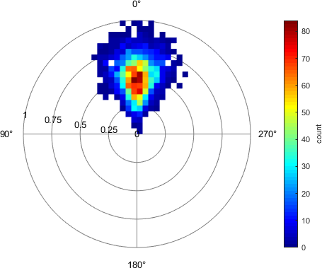

# histogram2Polar
`histogram2Polar` -- bivariate histogram plot from polar coordinates / position vectors in MATLAB.

Essentially, the coordinates are converted to Cartesian coordinates and fed to
MATLAB's `histogram2`. A polar-coordinate grid is then drawn in order to mimic a polar plot.
The properties and methods of this class are intended to mimic a polar plot like it
is created by `polaraxes` and properties with the same name, such as `'ThetaDir'`, mimic
the behavior of a real `polaraxes`. Note that this has limitations and might not work
flawlessly. Properties may be specified via `Name-Value` pairs during plot
construction or set post-hoc using dot-notation or `set(obj, param, val)`. `histogram2`
is called with the parameters `{'DisplayStyle', 'tile', 'ShowEmptyBins', 'off',
'EdgeColor', 'none'}`, which can be overridden by specifying the respective
`Name-Value` pairs during plot creation or by accessing the returned object's property
`'Histogram'`. Optional `Name-Value` pairs of this function support those specified
below and all `Name-Value` pairs as accepted by `histogram2`.

Syntax:

    histogram2Polar(theta, rho);
    histogram2Polar(theta, rho, binWidth);
    histogram2Polar(theta, rho, binWidth, Name, Value);
    histogram2Polar(target, ___);
    h = histogram2Polar(___);

[...] (See documentation)
